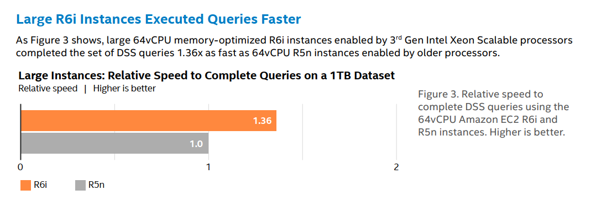

<p align="center">
  
</p>

# Intel® Optimized Cloud Modules for Terraform
© Copyright 2024, Intel Corporation

## AWS Aurora MySQL Module
This code creates an Amazon Aurora instance and RDS cluster for MySQL. The instance is created on an Intel Icelake instance R6i.large by default. The instance is pre-configured with parameters within the database parameter group that is optimized for Intel architecture. The goal of this module is to get you started with a database configured to run best on Intel architecture.
As you configure your application's environment, choose the configurations for your infrastructure that matches your application's requirements.
The MySQL Optimizations were based off [Intel Xeon Tuning Guide](<https://www.intel.com/content/www/us/en/developer/articles/guide/open-source-database-tuning-guide-on-xeon-systems.html>)


## AWS Aurora Performance Data 

<center>

#### [Choosing Amazon EC2 Memory-Optimized R6i Instances over R5n Instances Improves Decision Support Performance by up to 1.36x](https://www.intel.com/content/www/us/en/content-details/763185/choosing-amazon-ec2-memory-optimized-r6i-instances-over-r5n-instances-improves-decision-support-performance-by-up-to-1-36x.html?wapkw=r6i)



</center>

## AWS MySQL Performance Data - Following Data is Specific to MySQL and the Results May Vary for Aurora Module

<center>

#### [Process up to 1.33x more MySQL database transactions with the 3rd Generation Intel® Xeon® Scalable Processor (Ice Lake) vs. previous generation](https://www.intel.com/content/www/us/en/content-details/753185/book-up-to-1-42x-the-reservations-at-once-with-aws-ec2-m6i-instances-vs-aws-m5n-instances.html)

<p align="center">
  <a href="https://www.intel.com/content/www/us/en/content-details/753185/book-up-to-1-42x-the-reservations-at-once-with-aws-ec2-m6i-instances-vs-aws-m5n-instances.html">
  
  </a>
</p>

#

#### [Handle up to 1.32x more MySQL transactions per minute with AWS M6i 3rd Generation Intel® Xeon® Scalable Processor (Ice Lake) vs. previous generation](https://www.intel.com/content/www/us/en/content-details/752377/select-aws-ec2-m6i-instances-and-support-up-to-1-38x-the-ecommerce-transactions-for-mysql-databases-vs-aws-ec2-m5-instances.html)

<p align="center">
  <a href="https://www.intel.com/content/www/us/en/content-details/752377/select-aws-ec2-m6i-instances-and-support-up-to-1-38x-the-ecommerce-transactions-for-mysql-databases-vs-aws-ec2-m5-instances.html">
  
  </a>
</p>

#

#### [Get better price per performance($$/per) value by selecting Intel® Xeon® Scalable Processor vs. ARM](https://www.intel.com/content/www/us/en/content-details/765568/increase-mysql-database-transactions-by-1-65x-with-aws-ec2-m5-instances-vs-aws-ec2-m6g-instances.html)

<p align="center">
  <a href="https://www.intel.com/content/www/us/en/content-details/765568/increase-mysql-database-transactions-by-1-65x-with-aws-ec2-m5-instances-vs-aws-ec2-m6g-instances.html">
  
  </a>
</p>

#

#### [Process up to 1.18x more MySQL Transactions with AWS EC2 C5 Instances vs. AWS EC2 C5a Instances](https://www.intel.com/content/www/us/en/content-details/756027/process-up-to-1-18x-more-mysql-transactions-with-aws-ec2-c5-instances-vs-aws-ec2-c5a-instances.html)

<p align="center">
  <a href="https://www.intel.com/content/www/us/en/content-details/756027/process-up-to-1-18x-more-mysql-transactions-with-aws-ec2-c5-instances-vs-aws-ec2-c5a-instances.html">
  
  </a>
</p>


</center>

## Usage

**See examples folder for complete examples.**


By default, you will only have to pass three variables
```hcl
db_password
subnet_id
vpc_id
```

variables.tf
```hcl
variable "db_password" {
  description = "Password for the master database user."
  type        = string
  sensitive   = true
}
```

main.tf
```hcl
module "optimized-aurora-server" {
  source         = "intel/aws-aurora-mysql/intel"
  db_password    = var.db_password
  subnet_id   = "<ENTER YOUR SUBNET ID>"
  vpc_id = "<YOUR-VPC-ID-HERE>"
}
```

Run terraform

```bash
export TF_VAR_db_password ='<USE_A_STRONG_PASSWORD>'

terraform init  
terraform plan
terraform apply
```


## Considerations
- Check the variables.tf file for incoming ports allowed to connect to the database instance. The variable name is ingress_cidr_blocks. Currently it is defaulted to be open to the world like 0.0.0.0/0. Before runing the code, configure it based on specific security policies and requirements within the environment it is being implemented
- Check if you getting errors while running this Terraform code due to AWS defined soft limits or hard limits within your AWS account. Please work with your AWS support team to resolve limit constraints
- Using HashiCorp Modules alongside green-blue deployment allows for a secure and efficient deployment process. The modules can be easily integrated into both the active and inactive environments, ensuring consistency across both environments.
   - Instance - If you apply the instances will shut down immediately and restart, creating service interruption.
   - Platform - If you apply, it will wait for the next maintenance window to change the instance & configuration. You can force apply with additional TF code.

<!-- BEGIN_TF_DOCS -->
## Requirements

| Name | Version |
|------|---------|
| <a name="requirement_aws"></a> [aws](#requirement\_aws) | 5.31.0 |

## Providers

| Name | Version |
|------|---------|
| <a name="provider_aws"></a> [aws](#provider\_aws) | 5.31.0 |
| <a name="provider_random"></a> [random](#provider\_random) | n/a |

## Modules

No modules.

## Resources

| Name | Type |
|------|------|
| [aws_rds_cluster.default](https://registry.terraform.io/providers/hashicorp/aws/5.31.0/docs/resources/rds_cluster) | resource |
| [aws_rds_cluster_instance.cluster_instances](https://registry.terraform.io/providers/hashicorp/aws/5.31.0/docs/resources/rds_cluster_instance) | resource |
| [aws_rds_cluster_parameter_group.rds](https://registry.terraform.io/providers/hashicorp/aws/5.31.0/docs/resources/rds_cluster_parameter_group) | resource |
| [random_id.rid](https://registry.terraform.io/providers/hashicorp/random/latest/docs/resources/id) | resource |

## Inputs

| Name | Description | Type | Default | Required |
|------|-------------|------|---------|:--------:|
| <a name="input_auto_major_version_upgrades"></a> [auto\_major\_version\_upgrades](#input\_auto\_major\_version\_upgrades) | Flag that specifices if major version upgrades are allowed. Changing this parameter does not result in an outage and the change is asynchronously applied as soon as possible. | `bool` | `false` | no |
| <a name="input_auto_minor_version_upgrades"></a> [auto\_minor\_version\_upgrades](#input\_auto\_minor\_version\_upgrades) | Flag that specifies if minor engine upgrades will be applied automatically to the DB instance during the maintenance window. | `bool` | `true` | no |
| <a name="input_availability_zones"></a> [availability\_zones](#input\_availability\_zones) | Name of the Availability Zone the DB instance is located in. | `list(string)` | `null` | no |
| <a name="input_aws_security_group_name"></a> [aws\_security\_group\_name](#input\_aws\_security\_group\_name) | security group name for the rds | `string` | `"mysql_rds"` | no |
| <a name="input_backup_retention_period"></a> [backup\_retention\_period](#input\_backup\_retention\_period) | Specifies the number of days for which automatic DB snapshots are retained. | `number` | `5` | no |
| <a name="input_cluster_identifier"></a> [cluster\_identifier](#input\_cluster\_identifier) | If the DB instance is a member of a DB cluster, contains the name of the DB cluster that the DB instance is a member of. | `string` | `"aurora-cluster-demo"` | no |
| <a name="input_cluster_instance_identifier"></a> [cluster\_instance\_identifier](#input\_cluster\_instance\_identifier) | The identifier of the cluster instances. | `string` | `"aurora-cluster-instance-demo"` | no |
| <a name="input_create_security_group"></a> [create\_security\_group](#input\_create\_security\_group) | Flag that allows for the creation of a security group that allows access to the instance. Please use this for non-production use cases only. | `bool` | `false` | no |
| <a name="input_create_subnet_group"></a> [create\_subnet\_group](#input\_create\_subnet\_group) | Flag that allows for the creation of a subnet group that allows public access. | `bool` | `true` | no |
| <a name="input_database_name"></a> [database\_name](#input\_database\_name) | Contains the name of the initial database of this instance that was provided at create time | `string` | `"mydb"` | no |
| <a name="input_db_allocated_storage"></a> [db\_allocated\_storage](#input\_db\_allocated\_storage) | Allocated storage for AWS database instance. | `number` | `200` | no |
| <a name="input_db_apply_immediately"></a> [db\_apply\_immediately](#input\_db\_apply\_immediately) | Flag that specifies whether any database modifications are applied immediately, or during the next maintenance window. | `bool` | `false` | no |
| <a name="input_db_automated_backup_arn"></a> [db\_automated\_backup\_arn](#input\_db\_automated\_backup\_arn) | The ARN of the automated backup from which to restore. Required if source\_db\_instance\_identifier or source\_dbi\_resource\_id is not specified. | `string` | `null` | no |
| <a name="input_db_backup_window"></a> [db\_backup\_window](#input\_db\_backup\_window) | The daily time range (in UTC) during which automated backups are created if they are enabled. Example: `09:46-10:16.` Must not overlap with maintenance\_window. | `string` | `null` | no |
| <a name="input_db_ca_cert_identifier"></a> [db\_ca\_cert\_identifier](#input\_db\_ca\_cert\_identifier) | The identifier of the CA certificate for the DB instance. | `string` | `null` | no |
| <a name="input_db_cloudwatch_logs_export"></a> [db\_cloudwatch\_logs\_export](#input\_db\_cloudwatch\_logs\_export) | Set of log types to enable for exporting to CloudWatch logs. If omitted, no logs will be exported. | `list(string)` | `[]` | no |
| <a name="input_db_custom_iam_profile"></a> [db\_custom\_iam\_profile](#input\_db\_custom\_iam\_profile) | The instance profile associated with the underlying Amazon EC2 instance of an RDS Custom DB instance. | `string` | `null` | no |
| <a name="input_db_deletion_protection"></a> [db\_deletion\_protection](#input\_db\_deletion\_protection) | Flag that specifies whether the DB instance is protected from deletion. | `bool` | `false` | no |
| <a name="input_db_domain"></a> [db\_domain](#input\_db\_domain) | The ID of the Directory Service Active Directory domain to create the instance in. | `string` | `null` | no |
| <a name="input_db_domain_iam_role"></a> [db\_domain\_iam\_role](#input\_db\_domain\_iam\_role) | (Required if db\_domain is provided) The name of the IAM role to be used when making API calls to the Directory Service. | `string` | `null` | no |
| <a name="input_db_encryption"></a> [db\_encryption](#input\_db\_encryption) | Flag that specifies whether the DB instance is encrypted. | `bool` | `true` | no |
| <a name="input_db_iam_authentication"></a> [db\_iam\_authentication](#input\_db\_iam\_authentication) | Flag that specifies whether mappings of AWS Identity and Access Management (IAM) accounts to database accounts is enabled. | `bool` | `false` | no |
| <a name="input_db_iops"></a> [db\_iops](#input\_db\_iops) | The amount of provisioned IOPS. Setting this implies a storage\_type of io1. | `number` | `10000` | no |
| <a name="input_db_maintenance_window"></a> [db\_maintenance\_window](#input\_db\_maintenance\_window) | The window to perform maintenance in. Syntax: ddd:hh24:mi-ddd:hh24:mi | `string` | `null` | no |
| <a name="input_db_max_allocated_storage"></a> [db\_max\_allocated\_storage](#input\_db\_max\_allocated\_storage) | When configured, the upper limit to which Amazon RDS can automatically scale the storage of the DB instance. Configuring this will automatically ignore differences to allocated\_storage. Must be greater than or equal to allocated\_storage or 0 to disable Storage Autoscaling. | `number` | `10000` | no |
| <a name="input_db_monitoring_interval"></a> [db\_monitoring\_interval](#input\_db\_monitoring\_interval) | The interval, in seconds, between points when Enhanced Monitoring metrics are collected for the DB instance | `string` | `0` | no |
| <a name="input_db_monitoring_role_arn"></a> [db\_monitoring\_role\_arn](#input\_db\_monitoring\_role\_arn) | The ARN for the IAM role that permits RDS to send enhanced monitoring metrics to CloudWatch Logs | `string` | `null` | no |
| <a name="input_db_option_group"></a> [db\_option\_group](#input\_db\_option\_group) | Option group name to associate with the database instance. | `string` | `null` | no |
| <a name="input_db_parameter_group_family"></a> [db\_parameter\_group\_family](#input\_db\_parameter\_group\_family) | Family identifier for the RDS database parameter group. | `string` | `"mysql8.0"` | no |
| <a name="input_db_parameter_group_name"></a> [db\_parameter\_group\_name](#input\_db\_parameter\_group\_name) | Name for the RDS database parameter group. | `string` | `"aurora-mysql"` | no |
| <a name="input_db_parameters"></a> [db\_parameters](#input\_db\_parameters) | Intel Cloud optimizations for Xeon processors | <pre>object({<br>    aurora-mysql = object({<br>      table_open_cache = optional(object({<br>        value        = optional(string, "8000")<br>        apply_method = optional(string, "immediate")<br>      }))<br>      table_open_cache_instances = optional(object({<br>        value        = optional(string, "16")<br>        apply_method = optional(string, "pending-reboot")<br>      }))<br>      max_connections = optional(object({<br>        value        = optional(string, "4000")<br>        apply_method = optional(string, "immediate")<br>      }))<br>      back_log = optional(object({<br>        value        = optional(string, "1500")<br>        apply_method = optional(string, "pending-reboot")<br>      }))<br><br>      performance_schema = optional(object({<br>        value        = optional(string, "0")<br>        apply_method = optional(string, "pending-reboot")<br>      }))<br>      max_prepared_stmt_count = optional(object({<br>        value        = optional(string, "128000")<br>        apply_method = optional(string, "immediate")<br>      }))<br>      character_set_server = optional(object({<br>        value        = optional(string, "latin1")<br>        apply_method = optional(string, "immediate")<br>      }))<br>      collation_server = optional(object({<br>        value        = optional(string, "latin1_swedish_ci")<br>        apply_method = optional(string, "immediate")<br>      }))<br>      transaction_isolation = optional(object({<br>        value        = optional(string, "REPEATABLE-READ")<br>        apply_method = optional(string, "immediate")<br>      }))<br>      innodb_log_file_size = optional(object({<br>        value        = optional(string, 1024 * 1024 * 1024)<br>        apply_method = optional(string, "pending-reboot")<br>      }))<br>      innodb_open_files = optional(object({<br>        value        = optional(string, "4000")<br>        apply_method = optional(string, "pending-reboot")<br>      }))<br>      innodb_file_per_table = optional(object({<br>        value        = optional(string, "1")<br>        apply_method = optional(string, "pending-reboot")<br>      }))<br>      innodb_buffer_pool_instances = optional(object({<br>        value        = optional(string, "16")<br>        apply_method = optional(string, "pending-reboot")<br>      }))<br>      innodb_buffer_pool_size = optional(object({<br>        value        = optional(string, "64424509440") # 60 Gigabytes #Calculator https://convertlive.com/u/convert/gigabytes/to/bytes<br>        apply_method = optional(string, "pending-reboot")<br>      }))<br>      innodb_log_buffer_size = optional(object({<br>        value        = optional(string, "67108864")<br>        apply_method = optional(string, "pending-reboot")<br>      }))<br>      innodb_thread_concurrency = optional(object({<br>        value        = optional(string, "0")<br>        apply_method = optional(string, "immediate")<br>      }))<br>      join_buffer_size = optional(object({<br>        value        = optional(string, 32 * 1024)<br>        apply_method = optional(string, "immediate")<br>      }))<br>      sort_buffer_size = optional(object({<br>        value        = optional(string, 32 * 1024)<br>        apply_method = optional(string, "immediate")<br>      }))<br>      innodb_stats_persistent = optional(object({<br>        value        = optional(string, "ON")<br>        apply_method = optional(string, "immediate")<br>      }))<br>      innodb_spin_wait_delay = optional(object({<br>        value        = optional(string, "6")<br>        apply_method = optional(string, "immediate")<br>      }))<br>      innodb_max_purge_lag_delay = optional(object({<br>        value        = optional(string, "300000")<br>        apply_method = optional(string, "immediate")<br>      }))<br>      innodb_max_purge_lag = optional(object({<br>        value        = optional(string, "0")<br>        apply_method = optional(string, "immediate")<br>      }))<br>      innodb_lru_scan_depth = optional(object({<br>        value        = optional(string, "9000")<br>        apply_method = optional(string, "immediate")<br>      }))<br>      innodb_read_io_threads = optional(object({<br>        value        = optional(string, "16")<br>        apply_method = optional(string, "pending-reboot")<br>      }))<br>      innodb_purge_threads = optional(object({<br>        value        = optional(string, "4")<br>        apply_method = optional(string, "pending-reboot")<br>      }))<br>      innodb_adaptive_hash_index = optional(object({<br>        value        = optional(string, "0")<br>        apply_method = optional(string, "immediate")<br>      }))<br>      /* Cannot be Modified (AWS doesnt allow to modify this parameter)<br>      innodb_flush_log_at_trx_commit = optional(object({<br>        value        = optional(string, "0")<br>        apply_method = optional(string, "immediate")<br>      }))*/<br>    })<br>  })</pre> | <pre>{<br>  "aurora-mysql": {<br>    "back_log": {},<br>    "character_set_server": {},<br>    "collation_server": {},<br>    "default_password_lifetime": {},<br>    "innodb_adaptive_flushing": {},<br>    "innodb_adaptive_hash_index": {},<br>    "innodb_buffer_pool_instances": {},<br>    "innodb_buffer_pool_size": {},<br>    "innodb_change_buffering": {},<br>    "innodb_checksum_algorithm": {},<br>    "innodb_file_per_table": {},<br>    "innodb_flush_neighbors": {},<br>    "innodb_io_capacity": {},<br>    "innodb_io_capacity_max": {},<br>    "innodb_log_buffer_size": {},<br>    "innodb_log_file_size": {},<br>    "innodb_lru_scan_depth": {},<br>    "innodb_max_dirty_pages_pct": {},<br>    "innodb_max_dirty_pages_pct_lwm": {},<br>    "innodb_max_purge_lag": {},<br>    "innodb_max_purge_lag_delay": {},<br>    "innodb_open_files": {},<br>    "innodb_page_cleaners": {},<br>    "innodb_purge_threads": {},<br>    "innodb_read_io_threads": {},<br>    "innodb_spin_wait_delay": {},<br>    "innodb_stats_persistent": {},<br>    "innodb_thread_concurrency": {},<br>    "innodb_undo_log_truncate": {},<br>    "innodb_use_native_aio": {},<br>    "innodb_write_io_threads": {},<br>    "join_buffer_size": {},<br>    "max_connections": {},<br>    "max_prepared_stmt_count": {},<br>    "performance_schema": {},<br>    "sort_buffer_size": {},<br>    "table_open_cache": {},<br>    "table_open_cache_instances": {},<br>    "transaction_isolation": {}<br>  }<br>}</pre> | no |
| <a name="input_db_password"></a> [db\_password](#input\_db\_password) | Password for the master database user. | `string` | n/a | yes |
| <a name="input_db_performance_insights"></a> [db\_performance\_insights](#input\_db\_performance\_insights) | Flag that specifies whether Performance Insights are enabled. | `bool` | `false` | no |
| <a name="input_db_performance_retention_period"></a> [db\_performance\_retention\_period](#input\_db\_performance\_retention\_period) | Amount of time in days to retain Performance Insights data.Valid values are 7, 731 (2 years) or a multiple of 31. | `string` | `null` | no |
| <a name="input_db_port"></a> [db\_port](#input\_db\_port) | The port on which the DB accepts connections. | `number` | `null` | no |
| <a name="input_db_publicly_accessible"></a> [db\_publicly\_accessible](#input\_db\_publicly\_accessible) | Flag to indicate whether the database will be publicly accessible. | `bool` | `false` | no |
| <a name="input_db_replicate_source_db"></a> [db\_replicate\_source\_db](#input\_db\_replicate\_source\_db) | Specifies that this resource is a Replicate database, and to use this value as the source database. This correlates to the identifier of another Amazon RDS Database to replicate (if replicating within a single region) or ARN of the Amazon RDS Database to replicate (if replicating cross-region). Note that if you are creating a cross-region replica of an encrypted database you will also need to specify a kms\_key\_id. | `string` | `null` | no |
| <a name="input_db_restore_time"></a> [db\_restore\_time](#input\_db\_restore\_time) | The date and time to restore from. Value must be a time in Universal Coordinated Time (UTC) format and must be before the latest restorable time for the DB instance. | `string` | `null` | no |
| <a name="input_db_snapshot_identifier"></a> [db\_snapshot\_identifier](#input\_db\_snapshot\_identifier) | Specifies whether or not to create this database from a snapshot. This correlates to the snapshot ID you'd find in the RDS console. | `string` | `null` | no |
| <a name="input_db_source_db_instance_id"></a> [db\_source\_db\_instance\_id](#input\_db\_source\_db\_instance\_id) | The identifier of the source DB instance from which to restore. Must match the identifier of an existing DB instance. Required if source\_db\_instance\_automated\_backups\_arn or source\_dbi\_resource\_id is not specified. | `string` | `null` | no |
| <a name="input_db_source_dbi_resource_id"></a> [db\_source\_dbi\_resource\_id](#input\_db\_source\_dbi\_resource\_id) | The resource ID of the source DB instance from which to restore. Required if source\_db\_instance\_identifier or source\_db\_instance\_automated\_backups\_arn is not specified. | `string` | `null` | no |
| <a name="input_db_storage_type"></a> [db\_storage\_type](#input\_db\_storage\_type) | The storage type that will be set on the instance. If db\_iops is set then this will be set to io1 | `string` | `"io1"` | no |
| <a name="input_db_subnet_group_name"></a> [db\_subnet\_group\_name](#input\_db\_subnet\_group\_name) | Database subnet group name. | `string` | `null` | no |
| <a name="input_db_subnet_group_tag"></a> [db\_subnet\_group\_tag](#input\_db\_subnet\_group\_tag) | Tag for the database subnet group. | `map(string)` | <pre>{<br>  "Name": "mysql"<br>}</pre> | no |
| <a name="input_db_timeouts"></a> [db\_timeouts](#input\_db\_timeouts) | Map of timeouts that can be adjusted when executing the module. This allows you to customize how long certain operations are allowed to take before being considered to have failed. | <pre>object({<br>    create = optional(string, null)<br>    delete = optional(string, null)<br>    update = optional(string, null)<br>  })</pre> | <pre>{<br>  "db_timeouts": {}<br>}</pre> | no |
| <a name="input_db_use_latest_restore_time"></a> [db\_use\_latest\_restore\_time](#input\_db\_use\_latest\_restore\_time) | Flag that indicates whether the DB instance is restored from the latest backup time. | `bool` | `null` | no |
| <a name="input_egress_cidr_blocks"></a> [egress\_cidr\_blocks](#input\_egress\_cidr\_blocks) | Egress CIDR block for the RDS security group. | `list(string)` | <pre>[<br>  "0.0.0.0/0"<br>]</pre> | no |
| <a name="input_egress_from_port"></a> [egress\_from\_port](#input\_egress\_from\_port) | Starting egress port for the RDS security group. | `number` | `3306` | no |
| <a name="input_egress_protocol"></a> [egress\_protocol](#input\_egress\_protocol) | Egress protocol for the port defined in the RDS security group. | `string` | `"tcp"` | no |
| <a name="input_egress_to_port"></a> [egress\_to\_port](#input\_egress\_to\_port) | Ending egress port for the RDS security group. | `number` | `3306` | no |
| <a name="input_engine"></a> [engine](#input\_engine) | Database engine version for AWS database instance. | `string` | `"aurora-mysql"` | no |
| <a name="input_engine_version"></a> [engine\_version](#input\_engine\_version) | Database engine version for AWS database instance. | `string` | `"5.7.mysql_aurora.2.11.2"` | no |
| <a name="input_family"></a> [family](#input\_family) | The family of the DB cluster parameter group. | `string` | `"aurora5.6"` | no |
| <a name="input_final_snapshot_prefix"></a> [final\_snapshot\_prefix](#input\_final\_snapshot\_prefix) | The name which is prefixed to the final snapshot on database termination. | `string` | `"mysql-snap-"` | no |
| <a name="input_ingress_cidr_blocks"></a> [ingress\_cidr\_blocks](#input\_ingress\_cidr\_blocks) | Ingress CIDR block for the RDS security group. | `list(string)` | <pre>[<br>  "0.0.0.0/0"<br>]</pre> | no |
| <a name="input_ingress_from_port"></a> [ingress\_from\_port](#input\_ingress\_from\_port) | Starting ingress port for the RDS security group. | `number` | `3306` | no |
| <a name="input_ingress_protocol"></a> [ingress\_protocol](#input\_ingress\_protocol) | Ingress protocol for the port defined in the RDS security group. | `string` | `"tcp"` | no |
| <a name="input_ingress_to_port"></a> [ingress\_to\_port](#input\_ingress\_to\_port) | Ending ingress port for the RDS security group. | `number` | `3306` | no |
| <a name="input_instance_class"></a> [instance\_class](#input\_instance\_class) | The compute and memory capacity of each DB instance in the Multi-AZ DB cluster, for example db.m6g.xlarge. Not all DB instance classes are available in all AWS Regions, or for all database engines | `string` | `"db.r6i.large"` | no |
| <a name="input_kms_key_id"></a> [kms\_key\_id](#input\_kms\_key\_id) | The ARN for the KMS encryption key. If creating an encrypted replica, set this to the destination KMS ARN. | `string` | `null` | no |
| <a name="input_master_username"></a> [master\_username](#input\_master\_username) | Contains the master username for the DB instance. | `string` | `"foo"` | no |
| <a name="input_multi_az"></a> [multi\_az](#input\_multi\_az) | Flag that specifies if the RDS instance is multi\_az. | `bool` | `true` | no |
| <a name="input_name"></a> [name](#input\_name) | The name of the DB cluster parameter group. | `string` | `"rds-cluster-pg"` | no |
| <a name="input_preferred_backup_window"></a> [preferred\_backup\_window](#input\_preferred\_backup\_window) | Specifies the daily time range during which automated backups are created. | `string` | `"07:00-09:00"` | no |
| <a name="input_rds_security_group_tag"></a> [rds\_security\_group\_tag](#input\_rds\_security\_group\_tag) | Map of tags for the RDS security group. | `map(string)` | <pre>{<br>  "Name": "mysql_rds"<br>}</pre> | no |
| <a name="input_security_group_ids"></a> [security\_group\_ids](#input\_security\_group\_ids) | List of existing AWS security groups that will be attached to the RDS instance. | `list(string)` | `null` | no |
| <a name="input_skip_final_snapshot"></a> [skip\_final\_snapshot](#input\_skip\_final\_snapshot) | Flag to indicate whether a final snapshot will be skipped upon database termination. | `bool` | `true` | no |
| <a name="input_subnet_id"></a> [subnet\_id](#input\_subnet\_id) | The ID of the subnet where the EC2 instance will be launched. | `string` | n/a | yes |
| <a name="input_tags"></a> [tags](#input\_tags) | A mapping of tags to assign to all resources. | `map(string)` | `{}` | no |
| <a name="input_vpc_id"></a> [vpc\_id](#input\_vpc\_id) | VPC ID within which the database resource will be created. | `string` | n/a | yes |

## Outputs

| Name | Description |
|------|-------------|
| <a name="output_availability_zones"></a> [availability\_zones](#output\_availability\_zones) | Name of the Availability Zone the DB instance is located in. |
| <a name="output_backup_retention_period"></a> [backup\_retention\_period](#output\_backup\_retention\_period) | Specifies the number of days for which automatic DB snapshots are retained. |
| <a name="output_cluster_identifier"></a> [cluster\_identifier](#output\_cluster\_identifier) | Identifier of the aws\_rds\_cluster in which to launch this instance. |
| <a name="output_cluster_identifier1"></a> [cluster\_identifier1](#output\_cluster\_identifier1) | Identifier of the aws\_rds\_cluster in which to launch this instance. |
| <a name="output_cluster_identifier_default"></a> [cluster\_identifier\_default](#output\_cluster\_identifier\_default) | If the DB instance is a member of a DB cluster, contains the name of the DB cluster that the DB instance is a member of. |
| <a name="output_count"></a> [count](#output\_count) | To make multiple instances and join them all to the same RDS Cluster. |
| <a name="output_database_name"></a> [database\_name](#output\_database\_name) | Contains the name of the initial database of this instance that was provided at create time. |
| <a name="output_db_allocated_storage"></a> [db\_allocated\_storage](#output\_db\_allocated\_storage) | Storage that was allocated to the instance when it configured. |
| <a name="output_db_arn"></a> [db\_arn](#output\_db\_arn) | ARN of the database instance. |
| <a name="output_db_endpoint"></a> [db\_endpoint](#output\_db\_endpoint) | Connection endpoint for the database instance that has been created. |
| <a name="output_db_engine"></a> [db\_engine](#output\_db\_engine) | The database engine used by the RDS cluster. |
| <a name="output_db_instance_id"></a> [db\_instance\_id](#output\_db\_instance\_id) | The identifier of the RDS cluster instance. |
| <a name="output_db_kms_key_id"></a> [db\_kms\_key\_id](#output\_db\_kms\_key\_id) | KMS key that is configured on the database instance if storage encryption is enabled. |
| <a name="output_db_name"></a> [db\_name](#output\_db\_name) | Name of the database that was created (if specified) during instance creation. |
| <a name="output_db_port"></a> [db\_port](#output\_db\_port) | The port on which the RDS cluster is accessible. |
| <a name="output_dbi_resource_id"></a> [dbi\_resource\_id](#output\_dbi\_resource\_id) | Region-unique, immutable identifier for the DB instance. |
| <a name="output_dbi_resource_id1"></a> [dbi\_resource\_id1](#output\_dbi\_resource\_id1) | Region-unique, immutable identifier for the DB instance. |
| <a name="output_engine"></a> [engine](#output\_engine) | Database engine version for AWS database instance. |
| <a name="output_engine_default"></a> [engine\_default](#output\_engine\_default) | Default engine to use. |
| <a name="output_engine_version"></a> [engine\_version](#output\_engine\_version) | Database engine version for AWS database instance. |
| <a name="output_engine_version_default"></a> [engine\_version\_default](#output\_engine\_version\_default) | Default engine version to use. |
| <a name="output_family"></a> [family](#output\_family) | The family of the DB cluster parameter group. |
| <a name="output_identifier"></a> [identifier](#output\_identifier) | Identifier for the RDS instance, if omitted, Terraform will assign a random, unique identifier. |
| <a name="output_identifier1"></a> [identifier1](#output\_identifier1) | Identifier for the RDS instance, if omitted, Terraform will assign a random, unique identifier. |
| <a name="output_instance_class"></a> [instance\_class](#output\_instance\_class) | The compute and memory capacity of each DB instance in the Multi-AZ DB cluster, for example db.m6g.xlarge. Not all DB instance classes are available in all AWS Regions, or for all database engines. |
| <a name="output_kms_key_id"></a> [kms\_key\_id](#output\_kms\_key\_id) | The ARN for the KMS encryption key. If creating an encrypted replica, set this to the destination KMS ARN. |
| <a name="output_name"></a> [name](#output\_name) | The name of the DB cluster parameter group. |
| <a name="output_preferred_backup_window"></a> [preferred\_backup\_window](#output\_preferred\_backup\_window) | Specifies the daily time range during which automated backups are created. |
| <a name="output_skip_final_snapshot"></a> [skip\_final\_snapshot](#output\_skip\_final\_snapshot) | Flag to indicate whether a final snapshot will be skipped upon database termination. |
<!-- END_TF_DOCS -->